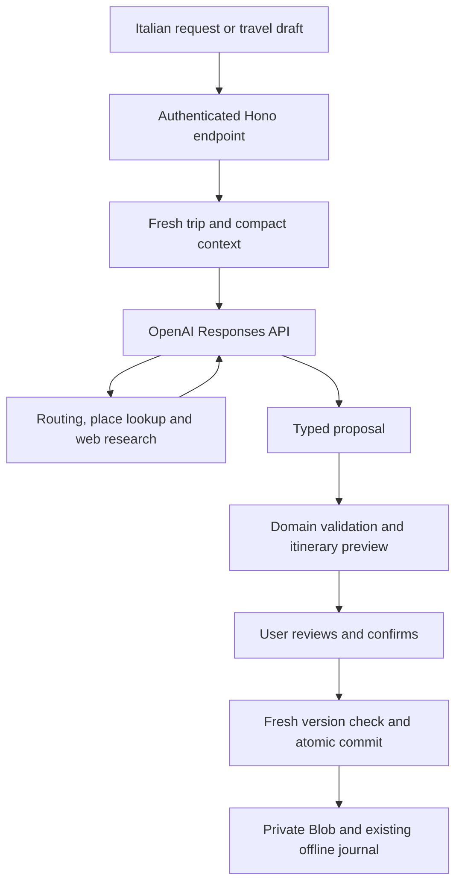

# AI itinerary assistance: feasibility and costs

The [security audit](SECURITY-AUDIT.md) adds mandatory launch requirements for
durable spending reservations, provider limits and abuse testing. Complete those
before connecting a paid provider.

Research date: 2026-10-05. Status: proposal for review; no AI integration has been implemented or paid API requests made.

## Recommendation

Both requested features are feasible on the existing React, Hono, Node 24 and private Vercel Blob architecture:

1. Research a better connection and useful points of interest when an itinerary changes.
2. Accept a natural-language request, propose coordinated itinerary changes, and apply the reviewed result.

Start with the OpenAI Responses API, a small set of application tools, and a walking-route provider. Keep the existing offline editor available independently. Use GPT-6.1 Sol initially for coordinated changes; evaluate GPT-6 Luna for simple requests before making it the cheaper default. Model quality and latency on this app are unmeasured.

My estimated operating envelope for a couple is **$2–10 in an active month**, assuming about 60 bounded requests, modest research, and free hosting/routing allowances. Heavy research or repeated conversations can exceed this. Budget arithmetic appears below.

## Existing infrastructure and actual gaps

| Capability                | Already available                                                              | Required addition                                                                |
| ------------------------- | ------------------------------------------------------------------------------ | -------------------------------------------------------------------------------- |
| Trip context              | Typed days, stops, legs, places, sources, costs and timezone                   | Build a compact, current context including preferences                           |
| Constraints               | Booked slots, manual locks, completed activities and immutable baseline        | Expose constraints to the model and retain server enforcement                    |
| Safe edits                | Pure travel commands, previews, validation, command IDs, ETags and storage CAS | Proposal records and approval of the exact reviewed version                      |
| Multiple devices          | Ordered offline journal and visible conflicts                                  | Mark AI proposals stale when their relevant trip state changes                   |
| Routes and POIs           | Full leg schema supports streets, distances, POIs and sources                  | Routing/geocoding/POI tools and a command to persist enriched routes             |
| Several coordinated edits | Commands currently apply one action at a time                                  | Atomic batch preview/apply, including final schedule validation                  |
| Agent execution           | Authenticated Hono API in a Node function                                      | A bounded tool loop and persistent request/proposal state                        |
| Offline assistance        | Manual travel adjustments already work offline                                 | Save pending questions and downloaded suggestions; generate new AI advice online |

The important code gap is `src/domain/travel.ts`: its route input accepts only endpoints, mode and duration. New connections deliberately receive empty streets, POIs and sources. Existing authored legs support richer data in `src/domain/schema.ts`, but sending extra fields to the current travel API would fail strict validation. Route enrichment therefore needs a real domain/API extension.

Use the same domain logic from `src/server/service.ts` and `src/client/api.ts`. A coordinated proposal must commit once against the original ETag; applying several public endpoints in succession would risk a partial result. Stable stop IDs, archived records, tickets, bookings and the authored baseline must survive the operation.

## How the two features would work

### Assistance inside Adatta

1. Continue producing an immediate local schedule preview.
2. Offer **Suggerisci percorso e luoghi** when connections or travel times change. An optional later setting could run this once per completed preview, rather than on every keystroke.
3. Compare a direct route with one scenic option, accounting for the available time before the next fixed activity.
4. Present streets, estimated walking time, distance, at most three relevant POIs, extra detour/visit time and clickable evidence.
5. Merge the selected option into the final preview and apply it after confirmation.

If connectivity or a provider fails, the manual editor remains usable. An offline manual change can sync first; research can then use the updated shared itinerary. It should not silently replace the accepted manual change later.

### Natural-language assistance

Example input: “We are 40 minutes late. Keep the booked visit and find somewhere nearby for lunch.”

The agent receives the affected day and its constraints, researches only what is needed, and produces up to two alternatives. Each explains moved/skipped/added activities, changed arrival times, route choices, POI detours and unresolved facts. The user can refine the proposal in Italian and then choose **Applica queste modifiche**.

The saved proposal binds the trip version, actions, route evidence and final preview. Applying it re-reads the trip and rejects relevant changes from another device. Replanning after a conflict produces a new review; it never attaches a new ETag to an old proposal to force a write.

## Agent architecture and context

The Responses API supports application-defined function tools. Our server executes those tools and returns results to the model. This provides the needed agent behavior inside ordinary request handlers. [OpenAI function calling](https://developers.openai.com/api/docs/guides/function-calling)

Proposed tools:

| Tool                    | Purpose                                                                   |
| ----------------------- | ------------------------------------------------------------------------- |
| `get_trip_context`      | Read only the authorized trip and relevant day(s)                         |
| `resolve_place`         | Resolve an address/entrance to sourced coordinates; ask if ambiguous      |
| `calculate_route`       | Fetch distance, duration and street instructions for a mode and waypoints |
| `find_pois_along_route` | Search a bounded corridor and return a small candidate set                |
| `preview_changes`       | Run proposed actions through the existing schedule rules                  |
| `create_proposal`       | Save a validated draft without changing the itinerary                     |

A separate authenticated apply endpoint executes the exact proposal confirmed by the user. The model does not need a general write token, shell, unrestricted HTTP client or direct Blob access. Server code restricts every tool to the authenticated trip, allowed fields and a bounded request size.

Context should contain the active sequence, adjacent days when relevant, timestamps/timezones, known entrances/coordinates, last completed activity, fixed reservations, costs and source freshness. Add user preferences such as walking tolerance, interests, meal budget, transport modes and maximum detour. Send stable IDs and only necessary traveler information. Ticket binaries, QR codes, booking references, credentials and unrelated trips stay out of prompts and search queries.

Use a short conversation summary and reload the actual trip on every request. A prior model response or chat transcript is not authoritative trip state. This scale does not require embeddings or a vector database.

Structured Outputs can constrain proposal shape, but can still contain factual mistakes. Domain validation and external route evidence remain necessary. [Structured Outputs](https://developers.openai.com/api/docs/guides/structured-outputs)

## Reliable routes and POIs

The model ranks and explains route options. A routing service supplies path data and travel estimates. Web research checks opening hours, entrances, booking pages and interesting background; search results alone do not establish a walkable path.

For each suggested POI, calculate the direct route and the route through its entrance. Additional travel time is their difference; visit/dwell time is a separate allowance. Reject options that exceed the agreed detour budget or conflict with an anchor. “Best” should mean a stated preference such as fastest or scenic within ten extra minutes, rather than an unsupported global optimum.

OpenAI web search supplies source annotations that need visible clickable citations in the UI. Preserve source URLs and research timestamps with the proposal, and distinguish verified facts from estimates. [OpenAI web search](https://developers.openai.com/api/docs/guides/tools-web-search)

### Provider options

| Option                               | Fit for this app                                                    | Tradeoff                                                                                                             |
| ------------------------------------ | ------------------------------------------------------------------- | -------------------------------------------------------------------------------------------------------------------- |
| openrouteservice                     | First candidate for walking routes, geocoding and POIs along a path | Check actual account quotas, local entrance quality and offline storage terms; public transport needs another source |
| Google Routes and Places             | Candidate when transit and richer business details matter           | Billing setup plus content storage, attribution and EEA-specific requirements                                        |
| Web research and existing Maps links | Useful contextual suggestions and navigation handoff                | Cannot provide validated path geometry or dependable detour arithmetic by itself                                     |

openrouteservice documents walking profiles, geocoding and POI searches around paths, and advertises free API access. Its current account plans/terms pages rendered no readable content in this research tool. Its indexed staging plans page lists free quotas, but I would verify them in the actual account before depending on exact numbers. The cost estimate assumes an available free allowance. [Services](https://openrouteservice.org/services/), [current plans portal](https://account.heigit.org/info/plans), [terms portal](https://account.heigit.org/info/tos)

Google currently lists 10,000 free monthly Compute Routes Essentials events, then $5/1,000 in the first paid band; Nearby Search Pro has 5,000 free events, then $32/1,000. Billing must be enabled; requested fields/features can trigger other SKUs. A small private trip could fit these allowances. [Pricing](https://developers.google.com/maps/billing-and-pricing/pricing), [Routes billing](https://developers.google.com/maps/documentation/routes/usage-and-billing)

Google restricts caching/storage of most Routes and Places content, with exceptions such as place IDs. This matters directly to our offline downloads. Review the applicable EEA terms and separate provider content from independently sourced itinerary information before choosing it. [Routes policies](https://developers.google.com/maps/documentation/routes/policies), [Places policies](https://developers.google.com/maps/documentation/places/web-service/policies)

**Proposed first scope:** walking, known stops and nearby attractions; keep Maps handoff for actual navigation. Public transport schedules, live closures and wheelchair suitability require provider-specific checks. The current app disables geolocation in its Permissions Policy: use the selected/last stop or a manually entered starting point initially.

## Can Vercel Hobby support it?

Yes, for bounded requests and a small private group. The language model runs at OpenAI; Vercel hosts authentication, tools, validation and orchestration. Keep React/Vite/Hono and private Blob; a stack migration is unnecessary.

The repository currently sets `api/index.ts` to **60 seconds**. Vercel documents a **300-second Hobby maximum with Fluid compute**, including time spent streaming. The project connector confirmed Node 24 and Vite but did not expose its Fluid setting. Verify that setting before relying on the larger limit; no hosting settings were changed during this analysis. [Function limits](https://vercel.com/docs/functions/limitations)

Suggested initial bounds: three model rounds, two web searches for a normal request, five for broader day research, a small route-call budget and a request deadline. Stream progress, support cancellation, and return a partial explanation without committing on timeout. Raising the configured duration after verifying Fluid would provide room, not guarantee latency.

For work that must survive closing the app, persist request status and proposals in separate private Blob objects with CAS, IDs and expiry. A recoverable flow can advance one step per authenticated polling request. OpenAI background mode can move model generation and hosted search outside a single Vercel request; our routing tools still need application execution and resumable orchestration. An SDK loop or `waitUntil` by itself is not a durable job queue. [Background mode](https://developers.openai.com/api/docs/guides/background)

Fluid Hobby includes 4 CPU-hours, 360 GB-hours of provisioned memory and one million invocations. Waiting for API I/O does not consume active CPU, though it occupies provisioned memory. An illustrative 60 runs at two minutes and 2 GB consume about 4 GB-hours, before other app usage and polling. This suggests ample personal-use headroom, subject to actual measurements and Blob/transfer quotas. [Compute usage](https://vercel.com/docs/functions/usage-and-pricing)

Hobby remains suitable for personal, non-commercial use. Revisit hosting and storage if this becomes a public service. [Hobby plan](https://vercel.com/docs/plans/hobby)

## OpenAI cost estimate

Published Standard prices, USD per million tokens, short context:

| Model       | Input | Output | Proposed role                                                          |
| ----------- | ----: | -----: | ---------------------------------------------------------------------- |
| GPT-6 Luna  | $0.10 |  $0.50 | Simple intent interpretation and bounded suggestions, after evaluation |
| GPT-6.1 Sol | $2.00 | $10.00 | Initial choice for coordinated itinerary changes                       |

[Luna pricing/capabilities](https://developers.openai.com/api/docs/models/gpt-6-luna), [Sol pricing/capabilities](https://developers.openai.com/api/docs/models/gpt-6.1-sol)

Hosted web search costs **$0.01 per search call**, plus search-content input tokens. Responses API has no separate endpoint fee. [API pricing](https://developers.openai.com/api/docs/pricing)

These are calculated scenarios, not measured app bills. Input totals include repeated context, tool results and search content across all model rounds. Output includes billable reasoning tokens as well as visible text. [Reasoning token billing](https://developers.openai.com/api/docs/guides/reasoning)

| Request                           | Aggregate input / output | Searches | Luna estimate | Sol estimate |
| --------------------------------- | ------------------------ | -------: | ------------: | -----------: |
| Small change using existing facts | 12,000 / 2,000           |        0 |       $0.0022 |       $0.044 |
| Route advice with researched POIs | 12,000 / 2,000           |        2 |       $0.0222 |       $0.064 |
| Broader coordinated day proposal  | 40,000 / 6,000           |        5 |        $0.057 |        $0.19 |

Formula: `input_tokens × input_rate / 1,000,000 + output_tokens × output_rate / 1,000,000 + searches × $0.01`.

For **50 route requests + 10 day proposals**, the scenarios total **$1.68 with Luna** or **$5.10 with Sol**. Reserve roughly twice those amounts for retries, refinements, larger tool results and cache-write charges. Rates above do not assume cache-read discounts; eligible cache writes can cost 1.25 times the listed input rate. Actual output reasoning can vary substantially. Taxes, currency conversion and any paid routing/provider usage are excluded.

Hosting and routing could remain $0 within their free allowances. OpenAI usage still needs its own funded API account; access to this model in our development session does not establish API access in the user's account. Verify billing, model availability and rate limits during a later approved setup.

Cost controls should include per-run model/tool budgets, durable monthly spend reservations, idempotent request IDs, one active request per trip and an AI kill switch. Enforce caps in the application before provider calls; do not rely only on an account budget notification. Avoid running research for every edit or automatically restarting interrupted requests.

## Privacy and operational behavior

Put `OPENAI_API_KEY` and any routing key only in server environment variables, with independent staging/production limits. Existing cookie authentication and same-origin write checks can gate assistance; no browser receives provider credentials.

OpenAI says API data is not used for training by default. Default abuse-monitoring retention can be up to 30 days, and stored Responses have their own retention. Prefer `store:false` and our private conversation summaries for foreground calls; background execution has temporary storage considerations. This does not establish zero retention. [API data controls](https://developers.openai.com/api/docs/guides/your-data)

Treat web pages/tool text as data, not instructions. They cannot authorize itinerary changes or override fixed times. Use fetched provider coordinates and preserve missing/uncertain information rather than filling it from model memory. Cache only what the selected provider permits, and label source freshness in downloaded advice.

AI generation and live route research require connectivity. Manual adjustments remain offline, pending questions can be retained for explicit retry, and previously downloaded advice stays readable. On reconnection, resolve the existing journal before obtaining advice from the shared plan. Cached proposals must be revalidated before applying.

## Work estimate and decision points

My planning estimate is **5–9 developer days** for an initial walking-focused implementation, depending on provider validation and the proposal UI:

| Work                                                          | Estimate |
| ------------------------------------------------------------- | -------- |
| Provider/account validation and representative routing checks | 1–2 days |
| Route enrichment, atomic proposals and agent tools            | 2–3 days |
| Italian assistance UI, preview and offline/reconnect behavior | 1–2 days |
| Evaluation, concurrency, failure tests and staging rollout    | 1–2 days |

This is an engineering estimate, not a fixed quote. Transit, interactive maps, voice or autonomous background replanning would expand it.

Before implementation, validate these choices with the user:

1. Walking-first scope with openrouteservice as the first provider candidate.
2. Sol for coordinated proposals, with Luna evaluated for simpler requests.
3. Explicit AI assistance actions initially; every shared plan change has a reviewed preview.
4. An application spending cap, e.g. $10/month, and short conversation history.
5. Online generation with existing offline manual editing preserved.

Acceptance checks should include factual POI citations, reproducible detour estimates, timezone/anchor protection, ambiguous requests, multiple-device conflicts, repeated apply IDs, interrupted sessions, provider timeouts and spend-cap exhaustion. Use a small representative evaluation set before enabling automatic route suggestions. No implementation is authorized by this research document.
