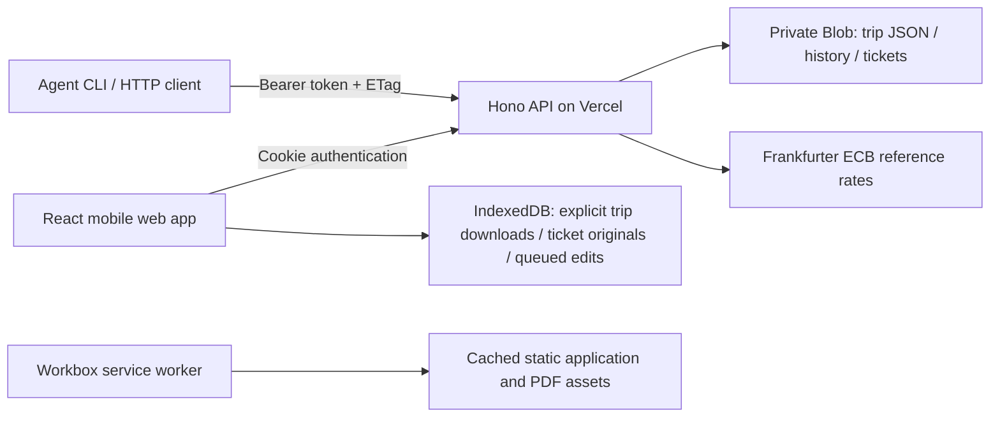

# Architecture and execution

## Delivered design

Trip data has no location-specific tables or application branching. Zod types/validation and pure itinerary/budget/navigation utilities are separated from React and can later be shared with React Native. The current ticket renderer, IndexedDB, service worker and routing are web-specific.

## Concurrency

Each trip is one document. File storage uses an atomic lock + rename locally. Blob storage uses `ifMatch` with the actual Blob ETag, and mutable reads bypass Blob caching. Both reject stale writes. Plan edits and runtime mutations are separate endpoints; plan edits preserve runtime state. Browser offline edits carry their original value and are applied against a newly read ETag. Changed values produce a visible conflict rather than a silent overwrite. This simple model suits a couple or small group; it is not a high-throughput multi-tenant system.

## Offline and privacy

Static assets are precached; API responses are never cached by the service worker. Explicit downloads put private trip documents and chosen ticket originals in IndexedDB. Browser state is available only within the locally saved 30-day session expiry. Online 401 responses clear private storage and query state. Logout clears all downloaded trips, tickets and pending edits on that device. No third-party analytics, embedded maps or GPS permissions are used.

The access key and separate agent token are random secrets whose SHA-256 hashes are stored on the server. The signed browser session is an HttpOnly, SameSite=Strict cookie, Secure over HTTPS. Browser mutations check Origin. Shared access permits both people to manage the same wallet; individual ownership is assignment/filtering rather than per-person authorization. Local downloads are not encrypted separately from browser storage and a disconnected device cannot receive remote revocation.

## Execution sequence

1. Choose deployable architecture and private storage; read the source itinerary.
2. Define/validate generic trip documents, then import source privately.
3. Build continuous overview, detailed stop/leg navigation and Italian UI.
4. Implement private bookings/files, shared state and ETag edits.
5. Implement explicit offline downloads, queued changes and conflict resolution.
6. Add original-currency and dated EUR estimates.
7. Verify schema/security/concurrency and mobile browser workflows, including production offline reloads.
8. Write agent/operator documentation and CI.
9. Publish code to GitHub, provision Vercel/private Blob, configure secrets, deploy and import private trip data.

## Improvements for later

- A browser trip editor, preserving the same validation and concurrency contract.
- Native app UI reusing domain schemas and API.
- GPX or interactive maps and richer weather/rain alternatives after source research.
- Per-user authentication and permissions if sharing expands beyond the private group.
- A dedicated MCP adapter around the existing documented API.

Current source-derived routing is a written guide with Google Maps handoff, not verified turn-by-turn navigation. Ticket availability and source opening hours must be rechecked before booking. The app does not promise up-to-the-minute availability or automatic replanning.
